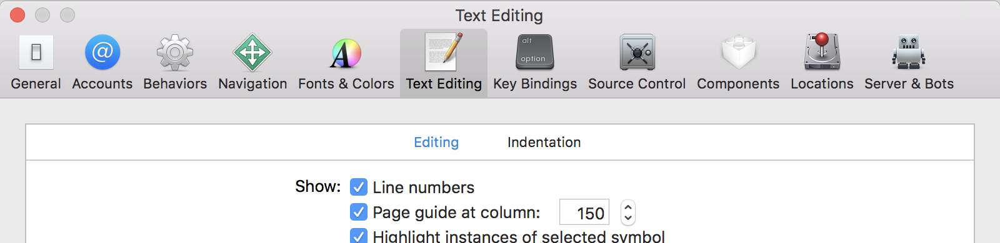

## General

* We care about clean code and aim to make this codebase as self-documenting and readable as possible.
* We primarily use Swift and the conventions enforced by Swift Lint except for the tweaks listed in [.swiftlint.yml](../.swiftlint.yml).  To see rules and how they apply to this project, from the project root directory execute `swiftlint rules`.
* There may be instances of code that pre-dates our use of this style guide, these can be refactored as we encounter them.

**IDE Setup:**

You must install swift lint.  You can do this using `brew install swiftlint` or installing it manually.  Then ID will then generate warnings and errors for style violations.

### Logging

We currently use `Logger.log(text:String)` or `Logger.log(items: Any....)` for logging.  This may change in the future, but please continue to use the same approach for now.

### Line breaks

We use a line margin of 150 rather than the default of 100 as the default causes excessive line breaks. The larger margin allows us to take advantage of modern widescreen monitors with more screen real-estate.

**IDE Setup:**

Xcode won't enforce or autoformat for you, but you can set up a page column at 150 characters.



### Unit test names

* We use the when then convention for test:

```when <condition> then <expected result>```

For example:

```testWhenUrlIsNotATrackerThenMatchesIsFalse()```
